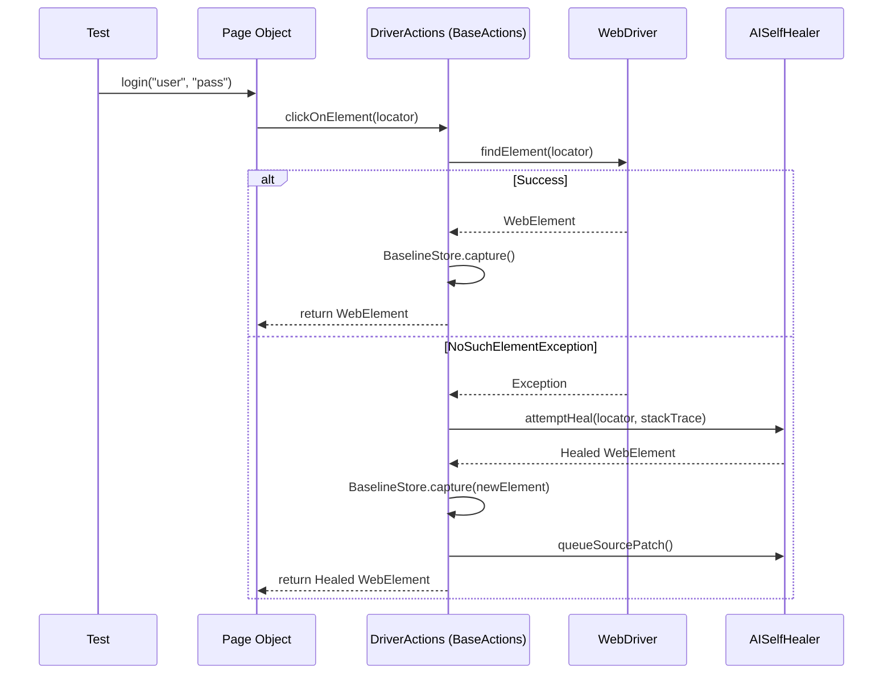
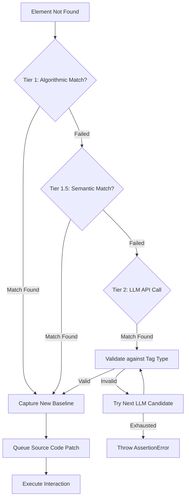

# Ellithium AI Service Architecture

The Ellithium AI module (`Ellithium.Utilities.ai`) provides a robust, multi-tiered self-healing and code generation engine integrated directly into the core `DriverActions` API. This document outlines its architecture, the healing tiers, internal algorithms, and how it seamlessly blends into the test execution flow.

---

## 1. High-Level Architecture

The AI Service is built to be invisible during successful test runs but highly proactive when failures occur. It sits between the user's Page Object Model (POM) and the raw Selenium/Appium WebDriver. 

Whenever a test interacts with an element via `DriverActions` (e.g., `driverActions.elements().clickOnElement(locator)`), the request routes through `BaseActions`. 

### Key Components

- **`EllithiumAIEngine`**: The main orchestrator and API facade exposing context generation, interaction recording, and test creation.
- **`BaseActions`**: The integration layer. It catches `NoSuchElementException` and `InvalidSelectorException` to trigger the self-healing process.
- **`AISelfHealer`**: The core healing engine that escalates through different recovery tiers and manages source code patching.
- **`BaselineStore`**: A silent caching mechanism that stores the "fingerprint" (HTML tag, attributes, text) of successfully found elements.
- **`SemanticLocatorResolver`**: The heuristic engine for Tier 1.5 healing.
- **`AccessibilityTreeExtractor`**: Extracts a cross-browser accessibility tree (AX Tree) via JavaScript injection to provide a clean, hallucination-resistant DOM view for the LLM.
- **`JavaSourceModifier` / `AIHealingReporter`**: Handlers for applying healed locators directly to the user's `.java` files (Local mode) or generating markdown reports (CI mode).

---

## 2. Integration with `DriverActions`

The AI is seamlessly integrated into `BaseActions.java` (the parent of `ElementActions`, `WaitActions`, etc.). 

1. **Successful Execution (Zero Overhead)**: When `findWebElement(By locator)` successfully finds an element, it calls `BaselineStore.capture()` to silently save the element's fingerprint in memory. 
2. **Failure Escalation**: If `driver.findElement()` fails, the exception is caught, and the healing escalation process begins.

---

## 3. The 3-Tier Self-Healing Algorithm

To balance speed and accuracy, Ellithium uses a tiered recovery system. It attempts fast, deterministic algorithms first, escalating to costly LLM calls only when necessary.

### Tier 1: Algorithmic Healing (Baseline Match)
**Speed: Instant (< 5ms)** | **Cost: Free** | **Accuracy: High**
- **How it works**: Before the locator broke, previous successful test runs captured its "fingerprint" (tag type, attributes, text) in `BaselineStore`. Tier 1 scans the current DOM for an element matching this exact fingerprint, regardless of the broken locator.
- **Validation**: Ensures the HTML tag type matches (e.g., an `<input>` cannot heal into a `
`).

### Tier 1.5: Semantic Healing (Heuristics)
**Speed: Fast (< 50ms)** | **Cost: Free** | **Accuracy: Medium**
- **How it works**: Managed by `SemanticLocatorResolver`. It extracts the execution context from the Java StackTrace:
  - **Action Type**: e.g., `sendData` means we are looking for an `<input>` or `<textarea>`.
  - **Method Name**: e.g., `setUserName` implies an element related to "username", "email", or "login".
  - **Field Name**: Evaluates the name of the variable holding the broken locator.
- **Algorithm**: It queries the DOM using heuristic XPath combinations derived from these semantic hints.

### Tier 2: LLM-Based Healing
**Speed: Slow (1-4s)** | **Cost: API Tokens** | **Accuracy: Very High**
- **How it works**: The ultimate fallback. `AISelfHealer.attemptHeal()` extracts the page's Accessibility Tree (`AccessibilityTreeExtractor`) and builds a strict prompt including the broken locator, the method name, and the action type.
- **Configuration**: Configurable via `ai-config.properties`. It requests `maxCandidates` (e.g., top 3 locators) and validates them against the DOM until one meets the `confidenceThreshold` (e.g., 0.70).
- **Cross-Validation**: The LLM's suggested locator must point to an element that matches the baseline tag type to prevent hallucinations.

---

## 4. Execution Modes & Self-Correction

Once a locator is healed, Ellithium can automatically correct the underlying Java code.

- **`HEAL_AND_CONTINUE`**: Heals the element in memory and continues the test.
- **`HEAL_AND_NOTIFY`**: 
  - **LOCAL Mode**: Uses `JavaSourceModifier` to parse the Abstract Syntax Tree (AST) of the POM file and overwrites the broken locator string on disk in real-time.
  - **CI Mode**: Collects all healed locators and generates a `healing-report.md` artifact at the end of the suite, preventing unauthorized code changes in remote environments.

## 5. Advanced AI Features

Beyond healing, the AI module provides tools for rapid test creation:

1. **In-Context Code Generation (`LiveContextGenerator`)**: 
   Developers can pause a test and call `EllithiumAIEngine.continueFrom(driver, steps)`. The AI reads the live, authenticated Accessibility Tree and generates the exact `DriverActions` code needed to perform the natural language steps.
   
2. **Interaction Recording (`InteractionRecorder`)**:
   Injects a floating toolbar into the browser. Testers interact manually, and the engine captures the DOM events, converting them into cleanly formatted POM methods and TestNG/Gherkin tests.
   
3. **Vision Root Cause Analysis (`AIVisionRCA`)**:
   If a test ultimately fails, the engine captures a screenshot and sends it to a vision-capable LLM (e.g., GPT-4o, Gemini Flash) to diagnose visual obstructions (e.g., "A cookie banner is blocking the login button"). This analysis is automatically attached to the Allure Report.
